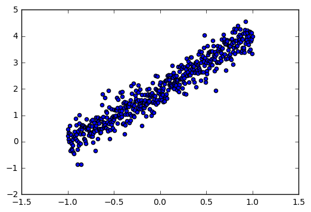
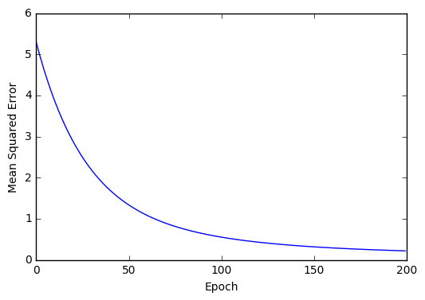
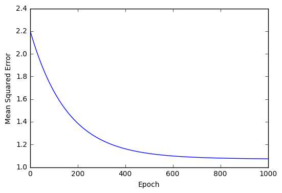
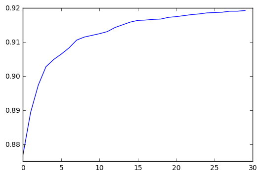
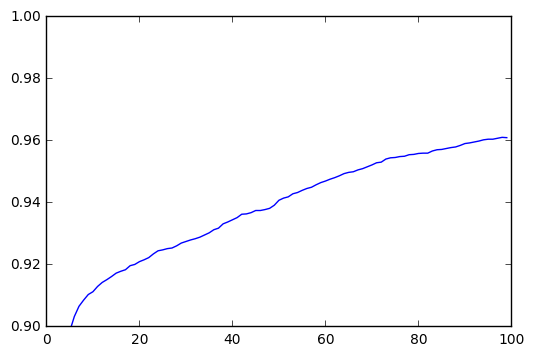
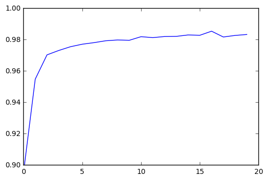

## What is TensorFlow?

If you've been following the machine learning community, in particular that of deep learning, over the last year, you've probably heard of Tensorflow. [Tensorflow](https://www.tensorflow.org/)<dt-cite key="tensorflow2015-whitepaper"></dt-cite> is a library to structure and run numerical computations developed in-house by Google Brain (the people who developed Alpha-GO). One can imagine this library as an extension of NumPY to work on more scalable architectures, as well as with more detailed algorithms and methods that pertain specifically to machine learning. Tensorflow joins Theano and cuDNN as architectures for building and designing neural networks. 

This article hopes to delve into Tensorflow through case studies of implementations of Neural Networks. As such, it requires advance knowledge of neural networks (the subject is too expansive to cover in a single article). For those new (and for those who need a refresher), here are some good reference materials

- http://neuralnetworksanddeeplearning.com/ (Basic)
- http://www.deeplearningbook.org/ (More Advanced)

### Installation

Tensorflow is available on PyPI, so we can simply pip install

```
    pip install tensorflow
```
Or if you have a GPU
```
    pip install tensorflow-gpu
```

More extensive installation details can be found on the [Tensorflow Installation Website](https://www.tensorflow.org/get_started/os_setup)

### How This Article Is Set Up

We follow the [Theano Tutorials](https://github.com/Newmu/Theano-Tutorials) <dt-cite key="gregor2015draw"></dt-cite> 
 which build up from basic addition/multiplication all the way to convolutional neural networks

#### Initial Investigations

1. Multiplication
2. Linear Regression
3. Logistic Regression

#### Neural Networks
4. Fully-connected Feed-Forward Neural Network (FC NN)
5. "Deep" Fully Connected Neural Network
6. Convolutional Neural Network

First, let's get the default imports out of the way: these imports will be used throughout the guide, and others will be added later when necessary


```python
import tensorflow as tf
import numpy as np
import matplotlib.pyplot as plt
%matplotlib inline
```

# Initial Investigations

## Multiplication

Given two floats $x$ and $y$, find $xy$

First we create the relevant variables `x` and `y` (initializing them as floats). Placeholders can be thought of as *inputs*; when doing computations, we'll plug in values for x and y. We symbolize the result that we are looking for as `xy`.


```python

x = tf.placeholder("float")
y = tf.placeholder("float")

xy = tf.mul(x,y)

```

Now we've represented the computation graph in Tensorflow; all that remains is to create a session, and plug in values, retrieving the result of the computation


```python
with tf.Session() as sess:
    print("%f x %f = %f"%(2,3,sess.run(xy,feed_dict={x:2,y:3})))
```

    2.000000 x 3.000000 = 6.000000


## Linear Regression

Given $\{(x_1,y_1) \dots (x_n,y_n)\}$, find $w$ and $b$ such that it minimizes $$\sum (wx_i + b - y_i)^2$$

First, let's create some sample data to work with: 

We model $y = 2x + \mathcal{N}(0,1)$ (there's some random noise)


```python
trX = np.linspace(-1, 1, 500)
trY = 2 * trX + np.random.randn(*trX.shape)*.35 + 2
plt.scatter(trX,trY);
```





Here, we again define our inputs `x` and `y` again. We define a  *variable* `w` which stores the weight; variables are objects in Tensorflow which we use to represent internal states and are updatable. Again `y_hat` is simply our prediction


```python
X = tf.placeholder("float")
Y = tf.placeholder("float")

w = tf.Variable(0.0,name="weights")
b = tf.Variable(0.0, name="bias")
y_hat = tf.add(tf.mul(X,w),b)
```

Let's now define our cost model and the underlying optimizer. Here, we opt for the squared loss objective (there are many others similar).

In order to optimize the function over $w$ and $b$, we create a GD optimizer, and minimize over the given cost function. Here we set $\alpha = .01$ (the learning rate)


```python
cost = tf.reduce_mean(tf.square(Y - y_hat))

train_operation = tf.train.GradientDescentOptimizer(.01).minimize(cost)
```

Now, we simply run the `train_operation`, passing in our input data (this is Gradient Descent , not SGD). Since we created variables (`w` and `b`), we need to initialize them in the session with `tf.initialize_all_variables().run()`


```python
numEpochs = 200
costs = []

with tf.Session() as sess:
    tf.initialize_all_variables().run()
    
    for i in range(numEpochs):
        sess.run(train_operation,feed_dict={X:trX,Y: trY})
        costs.append(sess.run(cost,feed_dict={X:trX,Y: trY}))
        
    print("Final Error is %f"%costs[-1])
    wfinal,bfinal = sess.run(w),sess.run(b)
    print("Predicting  y = %.02f x + %.02f"%(wfinal,bfinal))
    print("Actually is y = %.02f x + %.02f"%(2,2))
```

    Final Error is 0.217815
    Predicting  y = 1.52 x + 1.95
    Actually is y = 2.00 x + 2.00


```python
plt.plot(costs)
plt.ylabel("Mean Squared Error")
plt.xlabel("Epoch");
```





Let's try to expand this to the multivariable case, where $x \in \mathbb{R}^n$,$w \in \mathbb{R}^{n \times m}$, and where $y$ is modelled with gaussian noise as

$$ y = W^Tx + \mathcal{N}(0,I_m)$$


```python
m = 8
n = 5
NUM_EXAMPLES = 100

W = np.random.rand(n,m)

trX = np.random.rand(100,n)
trY = X.dot(W) + np.random.randn(NUM_EXAMPLES,m)
trX.shape, trY.shape
```


    ((100, 5), (100, 8))


We again define our `x` and `y` placeholder inputs similarly; however, this time we explicitly add a shape parameter to the data. The first `None` is the dimension of the batch-size (variable), and the second number our actual dimension.


```python
x = tf.placeholder("float",shape=[None, n])
y = tf.placeholder("float",shape=[None, m])

w = tf.Variable(tf.zeros([n,m]))
y_hat = tf.matmul(x,w)
```

The rest remains the same


```python
cost = tf.reduce_mean(tf.square(y - y_hat))

train_operation = tf.train.GradientDescentOptimizer(.01).minimize(cost)
```


```python
numEpochs = 1000
costs = []

with tf.Session() as sess:
    tf.initialize_all_variables().run()
    
    for i in range(numEpochs):
        sess.run(train_operation,feed_dict={x:trX,y: trY})
        costs.append(sess.run(cost,feed_dict={x:trX,y: trY}))
        
    print("Final Error is %f"%costs[-1])
```

    Final Error is 1.073464


```python
plt.plot(costs)
plt.ylabel("Mean Squared Error")
plt.xlabel("Epoch");
```





## Logistic Regression


We shall use the MNIST dataset for this example. Conveniently, Tensorflow has a library to read the MNIST files


```python
from tensorflow.examples.tutorials.mnist import input_data

mnist = input_data.read_data_sets("MNIST/",one_hot=True)
trX, trY = mnist.train.images, mnist.train.labels
teX, teY = mnist.test.images, mnist.test.labels
```

Recall in logistic regression that we model the *logit* as a linear transformation of $x$, and perform MLE over $W$. Notice the MLE likelihood function is simply just the cross entropy on the logit of the linear model. Using this philosophy, we express our logistic model


```python
X = tf.placeholder("float",shape=[None,784])
Y = tf.placeholder("float",shape=[None,10])

w = tf.Variable(tf.random_normal([784,10], stddev=0.01))

pred_logit = tf.matmul(X,w)
```


```python
sample_cost = tf.nn.softmax_cross_entropy_with_logits(pred_logit,Y)
total_cost = tf.reduce_mean(sample_cost)

train_operation = tf.train.GradientDescentOptimizer(0.05).minimize(total_cost)
predict_operation = tf.argmax(pred_logit, 1)
accuracy_operation = tf.reduce_mean(
                        tf.cast(tf.equal(predict_operation,tf.argmax(Y,1)),tf.float32)
                        )
```

Let's train! We'll do batch gradient descent here to speed up training times


```python
NUM_EPOCHS = 30
BATCH_SIZE = 200

accuracies = []

with tf.Session() as sess:
    tf.initialize_all_variables().run()
    
    for epoch in range(NUM_EPOCHS):
        for start in range(0,len(trX),BATCH_SIZE):
            end = start + BATCH_SIZE
            sess.run(train_operation, \
                    feed_dict = {X: trX[start:end],Y: trY[start:end]})
        accuracies.append(sess.run(accuracy_operation,feed_dict= {X: teX,Y: teY}))
```


```python
plt.plot(accuracies)
```


    [<matplotlib.lines.Line2D at 0x7fd8dc56ce48>]





# Neural Networks

## Basic Fully Connected Network

We shall use the *"classic"* starting neural network; which consists of the input layer, a hidden layer coupled with the *sigmoid* activation function, and finally an output layer, upon which we shall run softmax (paired with the cross-entropy loss). As in the previous example on logistic regression, the softmax won't be directly computed, and instead implicitly factored in through the cost function. We again shall train on the **MNIST** dataset


```python
NUM_HIDDEN = 620

X = tf.placeholder("float",shape=[None,784])
Y = tf.placeholder("float",shape=[None,10])

def init_weights(shape): # We define this out of convenience
    return tf.Variable(tf.random_normal(shape, stddev=0.01))

W_h = init_weights([784,NUM_HIDDEN]) # Weights entering the hidden layer
W_o = init_weights([NUM_HIDDEN,10]) # Weights entering the output layer
```


```python
entering_hidden = tf.matmul(X,W_h)
exiting_hidden = tf.nn.sigmoid(entering_hidden)
model = tf.matmul(exiting_hidden,W_o)

sample_cost = tf.nn.softmax_cross_entropy_with_logits(model,Y)
total_cost = tf.reduce_mean(sample_cost)

train_operation = tf.train.GradientDescentOptimizer(0.2).minimize(total_cost)
predict_operation = tf.argmax(model, 1)
accuracy_operation = tf.reduce_mean(
                        tf.cast(tf.equal(predict_operation,tf.argmax(Y,1)),tf.float32)
                        )
```


```python
NUM_EPOCHS = 100
BATCH_SIZE = 200
import tqdm
accuracies = []

with tf.Session() as sess:
    tf.initialize_all_variables().run()
    
    for epoch in tqdm.trange(NUM_EPOCHS):
        for start in range(0,len(trX),BATCH_SIZE):
            end = start + BATCH_SIZE
            sess.run(train_operation, \
                    feed_dict = {X: trX[start:end],Y: trY[start:end]})
        accuracies.append(sess.run(accuracy_operation,feed_dict= {X: teX,Y: teY}))
        print(accuracies[-1])
```


```python
print("Final Accuracy was %.04f"%accuracies[-1])
plt.plot(accuracies);plt.ylim(.9,1);
```

    Final Accuracy was 0.9609





With a lot of effort ($100$ epochs which took about $7$ minutes total to train on a laptop), we finally get to $96.09\%$ accuracy on the basic MNIST dataset. Anyone who's done any work on MNIST knows that that's a pretty bad score, especially with such a powerful model. The model must not be training correctly; next, we attempt to beef up the model with more modern techniques

## Modern Neural Network

Here we implement the following changes on the previous neural network to increase accuracy on MNIST
- [RELU](https://en.wikipedia.org/wiki/Rectifier_(neural_networks))
- [Dropout](https://www.cs.toronto.edu/~hinton/absps/JMLRdropout.pdf)
- [RMSProp Optimization](http://www.cs.toronto.edu/~tijmen/csc321/slides/lecture_slides_lec6.pdf)
- Another hidden layer cause *why not?*

We also shift the organization of the code,by abstracting out the model, so it is easier to parse when reading. As our models and networks get more complicated, this becomes a good idea to facilitate debugging


```python
def init_weights(shape):
    return tf.Variable(tf.random_normal(shape,stddev=0.01))

def model_gen(X,w_h,w_h2, w_o,drop_rate_input,drop_rate_hidden):
    out_X = tf.nn.dropout(X, drop_rate_input)
    
    in_H = tf.matmul(X,w_h)
    out_H = tf.nn.dropout(tf.nn.relu(in_H),drop_rate_hidden)
    
    in_H2 = tf.matmul(out_H,w_h2)
    out_H2 = tf.nn.relu(in_H2)
    
    model = tf.matmul(out_H2,w_o)
    return model

```


```python
X = tf.placeholder("float", [None, 784])
Y = tf.placeholder("float", [None, 10])

w_h = init_weights([784, 625])
w_h2 = init_weights([625, 625])
w_o = init_weights([625, 10])

drop_rate_input = tf.placeholder("float")
drop_rate_hidden = tf.placeholder("float")


model = model_gen(X,w_h,w_h2,w_o,drop_rate_input,drop_rate_hidden)

```


```python
sample_cost = tf.nn.softmax_cross_entropy_with_logits(model,Y)
total_cost = tf.reduce_mean(sample_cost)

train_operation = tf.train.RMSPropOptimizer(0.001,0.9).minimize(total_cost)
predict_operation = tf.argmax(model, 1)
accuracy_operation = tf.reduce_mean(
                        tf.cast(tf.equal(predict_operation,tf.argmax(Y,1)),tf.float32)
                        )
```


```python
NUM_EPOCHS = 20
BATCH_SIZE = 200
import tqdm
accuracies = []

with tf.Session() as sess:
    tf.initialize_all_variables().run()
    
    for epoch in tqdm.trange(NUM_EPOCHS):
        for start in range(0,len(trX),BATCH_SIZE):
            end = start + BATCH_SIZE
            sess.run(train_operation, \
                    feed_dict = {X: trX[start:end],Y: trY[start:end],
                    drop_rate_input: 0.8, drop_rate_hidden: 0.5})
        accuracies.append(sess.run(accuracy_operation,feed_dict= {X: teX,Y: teY,drop_rate_input: 1, drop_rate_hidden: 1}))
        print(accuracies[-1])
```


```python
print("Final Accuracy was %.04f"%accuracies[-1])
plt.plot(accuracies);plt.ylim(.9,1);
```

    Final Accuracy was 0.9833





This ran for $20$ epochs, taking about $4$ minutes total to train on a laptop, and the final training accuracy was  $98.33\%$ accuracy on the basic MNIST dataset. That's a sizable improvement on our basic MNIST algorithm, while taking less time to train. Next, we'll see another technique which has done *very* well on MNIST and other image databases, making it the defacto algorithm for image based ML in the industry

<script type="text/bibliography">
  @article{gregor2015draw,
    title={Theano Tutorials},
    author={Radford, Alec},
    journal={github},
    year={2014},
    url={https://github.com/Newmu/Theano-Tutorials}
  },
@misc{tensorflow2015-whitepaper,
title={ <i>TensorFlow</i>: Large-Scale Machine Learning on Heterogeneous Systems},
url={http://tensorflow.org/},
note={Software available from tensorflow.org},
author={
    Mart'in~Abadi  et al.},
  year={2015},
}
</script>