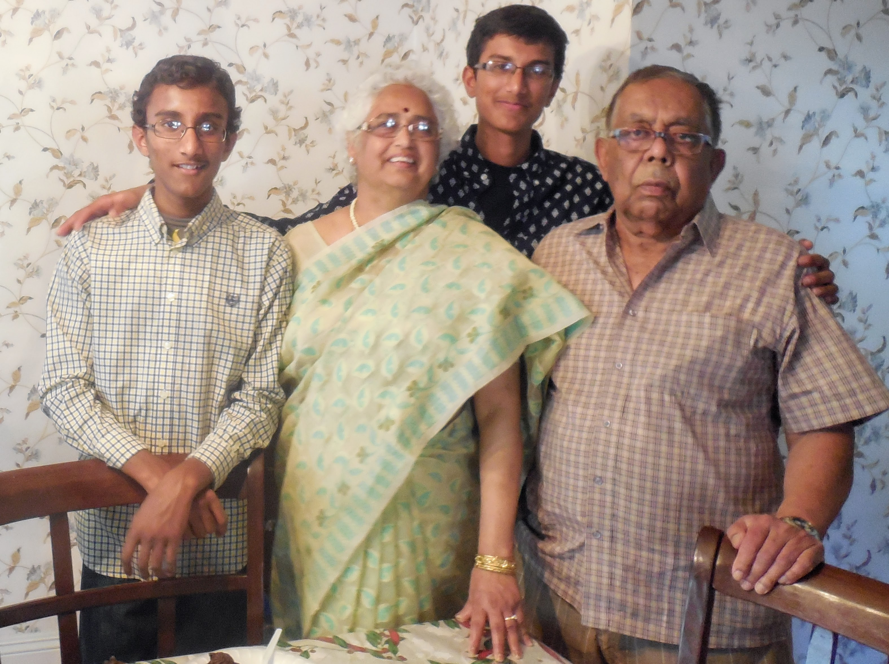

# The Death of a Childhood

### Manash Biswas - (1939 - 2019)

Every night, at roughly 8:45, the phone would ring, and the same conversation would play out - "Hello? Eta ki Dibya? Haan. Kemon achho? Bhalo acchi. Dhruba kothai? ". And so it was, every day, rain or shine, weekday or weekend, a call always in the waiting. But then the calls came less frequently. Then less. Then even less. And now, there will be none.

Is it not a shame how a childhood passes? We never appreciate what we have till we lose it. And for the first time in my life, I've fallen into this hole. Why did I not appreciate and love it while it lasted? That thought will perhaps haunt me for years to come.

Who was he? Aagu? Alameda-er Aagu? Or Manash-da? It's hard to imagine how a man who shied away from the spotlight, can take such an integral part in so many people's lives. As I turn in retrospect, thinking in how so many ways that Aagu has touched my life, it's undeniable the subtle effect he's permeated.

Aagu was never one for the limelight. I don't have a single picture of his, beyond a birthday of his 7 years ago, and another of mine even further back. Even in real life, he was a spectator, casually looking until his opportunity came. For a man who rarely spoke, his unusual way of showing his love inspires me.

Aagu is the original iron man, a man who stands tall in the face of adversity no matter the difficulty. This is way before my time, so I can only speak of legend: but the man who pioneered his way to America, a land of the xenophobic and the strange, when the number of people who spoke his language could probably be counted on one hand. 

My dad arrived in America in the early 90s. Aagu and Thamma, who mentored and provided a family away from home to him. It's only natural, that when Ma came, and later myself, that he became my "Aagu", and soon after my "best friend". I don't remember much from these early years, but the videos that remain bring me to tears. He loved me like I was his own blood, and although he never said it outright, the subtle ways he expressed it were his unique stamp and signature.

Aagu's passing brings me great grief. It perhaps is the final call for my childhood. My conversations with Aagu, the dreams of becoming the president, the dreams of Dhruba becoming a doctor, reflect the childlike innocence that we immersed ourselves in. It was a time and place when anything and everything was possible. A time when whatever we set our minds on could become reality. A time of endless possibilities - when anything we said could be true. When there was nothing to care for, and life was happy.

But life sobers up fast. And with the deteriorating health of Aagu, the growing up of me and Chotton, these dreams slowly began to fade, and the reality of the world began to settle around us. Aagu stopped being able to visit us, and then soon the calls stopped coming. And then the physical pains hit, and he was sent to the Wellness Center. Perhaps that was the beginning of the end. Perhaps we all saw it coming. But even so, I can say with great clarity that my childhood ended on 4/11/2019 at 11:00 AM, when Aagu took his last breath. The last shard of innocence has shattered, and now the cold jaded front is all that remains. The anchor has broken.

I have many regrets. I wish I picked up the phone more often when I was in college, instead of hanging up, because I was "busy". I wish I visited Aagu more often when he was sick. I wish I was there during his time of greatest agony. I wish I could have told him what he meant to me, and the amazing impact he's had on my life. I wish he could see me graduate. But these will remain "I wish". So, to Aagu, if you can hear me up in Heaven, these words are for you. I miss you. I miss your quick wit, and your humor. I didn't appreciate what you said, and I wish I had. I hope you're smiling on me, and what I've done, and what I've become. I hope you're proud of me.

*What do I hope to be known for when I die?* These questions are not one that one hopes to answer at age 21. But these are the questions that come to mind as I write this eulogy. I care about impact and making a difference, but perhaps what I care most about, is appearing a "trustworthy man who everyone loved, and who loved everyone". Someone whose love knows no bounds, and whose love shapes and steers lives. I want to be known for compassion, not for technical strength. These moments of great sorrow and reflection allow us to think back on this.

As I write this farewell, I've been scrolling through my Google Photos: from 2004 to today, desparetely trying to find the last memories I have. I've scrolled through Agu and Dida coming twice, our heights doubling, Baba losing his mustache,  Thamma graying her hair, me getting braces, me going to college, and Dhruba going to college. You're remained a constant, perhaps a simple shadow, no matter where I went. It will be different. Nay, it will be difficult without you. 

Perhaps one thing is clear to me. These were the good old days. When we surrounds ourselves with love and family and passion, not the cold separating isolation of the real world. I was naive and innocent, and in the magic of childhood, anything could have happened. Thank you, Agu. You've touched a little boy's heart to a far greater degree than you can have potentially realized.

I'm about to graduate from college, and proceed into my graduate studies and later into my career. I wish you could see me today.  I wish you could have watched me walk across the stage, maybe even down the aisle. But even though you can't see it now,  I hope you can see me from heaven. Because this one? This one is for you, Aagu. <3

>  Manash Biswas (Aagu) passed away on April 11th, 2019 at 11:00 AM in the presence of his family at the Alameda Wellness center. He is survived in blood relations, by Jhunu Biswas (Thamma), his wife, and through connections forged, with so many more. He leaves a legacy not just in fame or reputation, but more so in character, family, and love. He will be missed by many.

